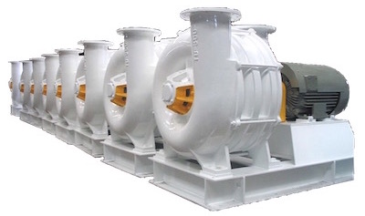

{.width-33 .alignright}

High pressure gas is highly demanded in different industrial branches.
Gas blowers can be operated in any conditions, even in the most severe
ones. Thus they are widely used at gas feeding in oil refining industry,
at process gas feeding in steel production, at methane pumping out of
coal mines, at cement and limestone plants, at waste water treatment
units, for pneumatic transportation, for water aeration, at creation
rarefied air or vacuum and air combustion.

JSC PKF "PromHim-Sfera" supplies equipment for operations with air and
almost all the process gases, both inert and aggressive.

{.width-33 .alignright}

This equipment has significant advantages in comparison with its
analogues:

* High efficiency at any operation mode;
* Wide range of standard air blowers;
* Explosion safety and impact resistance;
* Application of impellers with aerodynamic blades, which have high
  efficiency and low noise level;
* At customer's request, anti-corrosion, gas-tight, fire resistant
  design can be chosen;
* Increased safety degree;
* Long operation period;
* Accident free unit operation.
