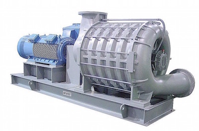

Высокое давление газа очень востребовано во многих отраслях
промышленности. Газодувки могут эксплуатироваться в любых условиях, даже
в самых тяжелых. Так, они находят активное применение при подаче газов в
нефтеперерабатывающей промышленности, при подаче технологического газа
при производстве стали, при откачке метана из угольных шахт, на
цементных и известковых заводах, в установках очистки сточных вод, для
пневматической транспортировки, аэрации воды, создания разряженного
воздуха или вакуума, сжигания воздуха.

ЗАО ПКФ "ПромХим-Сфера" предлагает оборудование для работы с воздухом и
практически с любыми технологическими газами -- как с инертными, так с
агрессивными.

Данное оборудование имеет существенные преимущества по сравнению с
аналогами:
* Высокий КПД в любом режиме работы;
* Широкая номенклатура типовых воздуходувок;
* Взрывобезопасность и ударостойкость;
* Применение крыльчаток с аэродинамическими лопастями, обладающими
  высокой эффективностью и низким уровнем шума;
* Согласно требованиям заказчика можно подобрать антикоррозионные,
  газонепроницаемые, огнеупорные конструкции;
* Повышенная степень безопасности;
* Долгий эксплуатационный период;
* Безаварийная работа установки.
