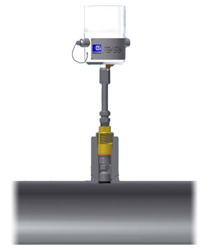
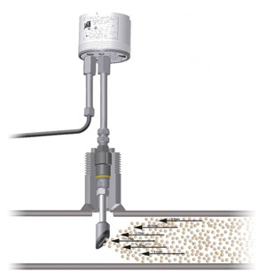

JSC PKF "PromHim-Sfera" offers a wide range of Rohrback Cosasco Systems products for corrosion monitoring:
* The main factor at selection of corrosion monitoring equipment by RCS is its wide range of applications: from observation of the actual pipeline wall thickness to identification of corrosion processes affecting factors.
* Industrial application of the RCS systems allows to respond immediately to any changes in the operating process reducing the risks of corrosion.

A distinguishing feature of probes with flat working surface is a possibility of flush mounting with pipeline wall. The undeniable advantage of using this type of probe is a possibility of application on pipelines, which has to be cleaned with pigs periodically.

Quick Sand Erosion Sensor

The unique advantage of the Quick Sand sensors is a possibility of evaluation of two corrosion processes - erosion process (abrasive wear) and corrosion.

The Quick Sand sensor allows to evaluate swiftly the negative impact of mechanical impurities on the most hazardous sections of pipeline.
