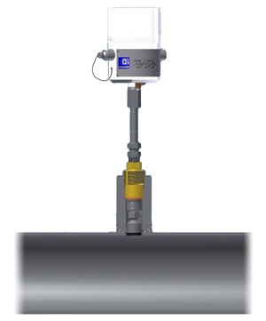
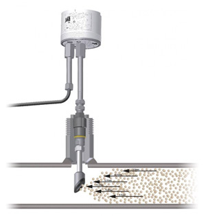

{.width-20 .alignright}

Компания ЗАО ПКФ "ПромХим-Сфера" предлагает широкий ряд изделий
производства **Rohrback Cosasco Systems** для контроля коррозии:

* Главным фактором при выборе оборудования мониторинга коррозии RCS
  является его широкий спектр применения: от наблюдения за реальной
  толщиной стенки трубопровода до выявления факторов влияющих на
  коррозионные процессы.
* Промышленное применение систем RCS позволяет оперативно реагировать на
  любые изменения в технологическом процессе, снижая коррозионные риски.

Отличительной особенностью зондов с плоской рабочей поверхностью
является возможность монтажа "заподлицо" со стенкой трубы. Неоспоримым
преимуществом использования данного типа зонда является возможность
применения на трубопроводах, которые необходимо периодически очищать при
помощи скребков.

## Эрозионный датчик Quick Sand {.width-20 .alignright}

Уникальным преимуществом датчиков Quick Sand является возможность оценки
двух коррозионных процессов -- процесс эрозии (абразивный износ) и
коррозии.

Датчик Quick Sand позволяет оперативно оценивать негативное воздействие
механических примесей на особо опасных участках трубопровода.
