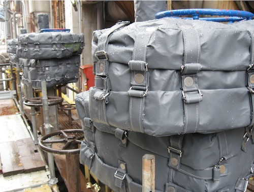
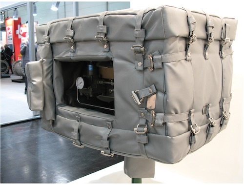
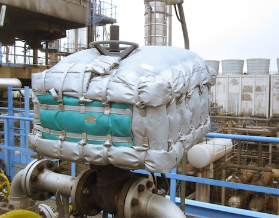

Effective fire protection for:
* Electric, pneumatic and hydraulic drives
* Blocking and control valves, ESDV
* Joint flanges
* Control and monitoring panels
* Any other element of critical installation area
* Can be installed without the need of unit operation stop;
* Made to order, minimal size;
* Resistance to the atmospheric impact, ultraviolet rays, cold, marine
  environment, chemical reagents and acids;
* Materials are safe and do not contain asbestos derivatives;
* Resistance to fire impact for 2 hours with temperature up to 1400 ˚С.

Fire protection guarantees full functioning of critical systems,
protected for the whole period of time, demanded by the client,
preventing further damaging of devices, products, things and people.

Fire protection equipment supplied by our company has all the necessary
certificates and licenses. The entire production stage, starting from
purchasing raw materials to packaging and shipping to the customers is
carried out under quality control and in accordance with ISO 9001-2008
standards certified by Bureau Veritas.

