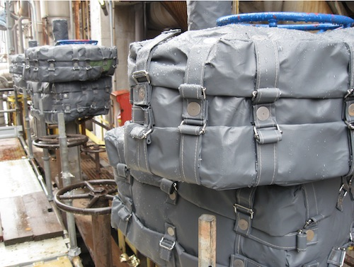
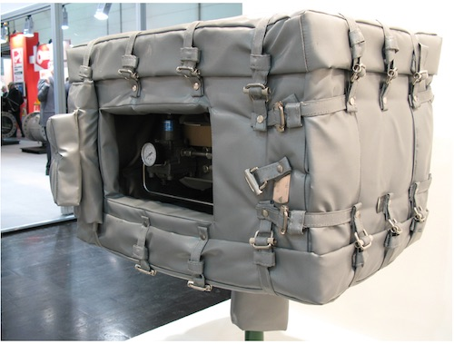

{.width-33 .alignright}

Эффективная защита от огня для:
* Электрических, пневматических и гидравлических приводов
* Блокирующих и регулирующих клапанов, ESDV
* Фланец соединений
* Панели управления и контроля
* Любого другого элемента критической зоны установки
* Устанавливаются без необходимости остановки установки;
* Выполненные по заказу, имеют минимальные размеры;
* Выдерживают сопротивление атмосферным воздействиям, ультрафиолетовым
  лучам, холоду, морской среде, химическим реагентам и кислотам;
* Материалы, из которых они изготовлены не являются опасными и не
  содержат производных асбеста;
* Выдерживают сопротивление огню в течении 2 часов до температуры
  1400 ˚С.

Защита гарантирует полное функционирование критических систем,
защищенных на весь период времени, запрошенный клиентом, под контролем
задерживая повреждения и предотвращения еще больший ущерб аппаратам,
изделиям, вещам и людям.

Поставляемая нами огнезащита имеет все необходимые сертификаты и
свидетельства, весь производственный этап, от закупок сырья до упаковки
и отправки клиентам выполняются в режиме контроля качества и
соответствии с нормативами ISO 9001-2008 сертифицированными Bureau
Veritas.

{.width-33}
{.width-33}
{.width-33}
