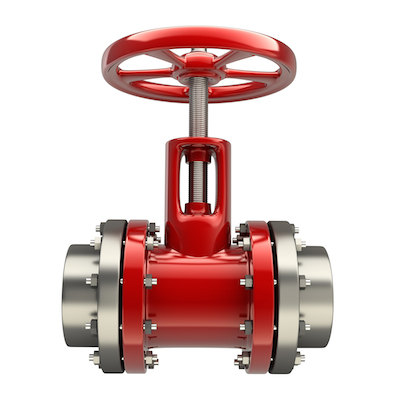

Компания ЗАО ПКФ "ПромХим-Сфера" специализируется на поставках
элементов оборудования следующих отраслей промышленности:
* Тепловая и атомная энергетика
* химия и нефтехимия
* металлургия
* газовая и нефтяная промышленность
* водоснабжение

Специфика работы данных предприятий связана с транспортировкой
жидкостей.

Мы поставляем соединительные, регулирующие, запорные арматуры, трубы,
трубные фасонные части и другие элементы технологического оборудования и
стремимся к тому, чтобы Ваше предприятие, оснащенное высококачественным
оборудованием, всегда поставляло потребителю продукцию на уровне мировых
стандартов.
