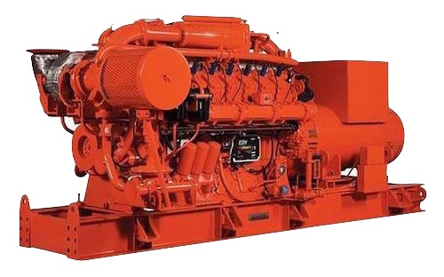

{.width-33 .alignright}

Из всего многообразия компрессорного оборудования, производимого в
настоящее время ведущими мировыми компаниями, ЗАО ПКФ "ПромХим-Сфера"
готова осуществляет подбор оборудования, которое будет оптимально
подходить для конкретной задачи по снабжению сжатым газом конкретного
потребителя. Обладая обширной базой поставщиков из Германии, Франции,
Италии, США, мы имеем возможность поставок различных типов компрессоров:
поршневых и центробежных, винтовых, мембранных, кулачковых, а также
компрессоров других типов.

Для оптимального подбора компрессора и его привода, обеспечивающего
наиболее эффективную подачу сжатого газа необходимо знать как минимум
ряд базовых параметров:

### Состав сжимаемого газа

Обычно колебания состава сжимаемого газа происходят в относительно
небольших пределах, не оказывающих влияния на производительность
компрессора, однако, в случае прогнозируемых существенных изменений
параметров газа необходимо указание пределов изменений его состава.

### Давление сжимаемого газа и пределы его измерения

Для надёжной, экономичной и безопасной эксплуатации компрессора
необходимо точное определение пределов колебаний давлений, т.к.
например, существенное превышение впускного давления в компрессор с
фиксированной степенью повышения давления может негативно сказаться на
работоспособности компрессора.

### Расход газа и пределы его колебаний

В зависимости от типа компрессора варьируются пределы экономичного и
безопасного регулирования расхода компримируемого газа. При этом
необходимо знать как максимальное, так и минимальное давление газа на
всасе в компрессор, что позволит подобрать компрессор, обеспечивающий
как работоспособность при минимальном давлении на всасе, так и
безопасную эксплуатацию при максимальном давлении.

### Наличие примесей

Примеси, поступающие на всас компрессора, например такие как капельная
влага или иные жидкости, а также пыль оказывают вредное воздействие на
большинство компрессоров. В зависимости от типа применяемого
компрессора, та также требований к качеству выходного воздуха может
потребоваться подбор сепаратора на всасе. В зависимости от требований к
качеству сжатого газа может подбираться система подготовки газа на
выпуске, например система осушки, масляный сепаратор или система
каталитического разложения органических соединений (компрессорного
масла). Также будет определён тип компрессора (сухого сжатия,
маслозаполненный, водокольцевой и т.д.).

### Режим работы оборудования

На периодичность и продолжительность рабочих кампаний оборудования
влияет как сменность работы на предприятии, так и особенности
технологического процесса. В этой связи необходимо точно знать как
минимум число пусков оборудования (в сутки, в месяц), минимальное и
максимальное необходимое время, которое должен наработать компрессор до
останова.

### Периодичность сервиса

Режим работы оборудования, а также режим эксплуатации предприятия, в
частности -- периодичность и сроки проведения ППР зачастую определяют
типы компрессоров, которые могут рассматриваться для использования на
объекте.

### Предпочтительный тип компрессора

Учитывая, что максимально полное заполнение опросного листа позволяет
подобрать наиболее экономичный тип оборудования, обеспечивающий
необходимую надёжность, то тип компрессора оптимально указать для
случая, когда уже имеется опыт эксплуатации некоторых компрессоров на
предприятии. Например, когда есть подготовленные специалисты для
обслуживания, поршневых, центробежных или винтовых компрессоров. Также,
если, например высокая загрузка существующего эксплуатационного
персонала, то можно задать типы компрессоров, требующие минимальное
количество человеко-часов в год для своего сервиса.

### Характеристики зоны установки компрессора

В зависимости от климатических условий и категорийности зоны размещения
оборудования по взрывоопасности будет уточнён как тип компрессора, так и
допустимый тип привода. Геофизические, в том числе и климатические
параметры определят не только требования к системе смазки, охлаждения и
фундаменту компрессора, но также и исполнение контейнера. При этом
контейнерная поставка имеет как ряд существенных плюсов, так и минусов.
В этой связи необходимо взвесить требования к зоне установке, климату,
режиму эксплуатации, что бы принять обоснованно решение по необходимости
и оптимальности контейнерной поставки.

### Тип привода компрессора

В зависимости от доступных топливно-энергетических ресурсов (ТЭР),
требований к надёжности компрессора и периодичности сервисного
обслуживания могут использоваться различные типы приводов. Например,
наиболее экономичными приводами для компрессоров, мощностью 300 -- 1000
кВт и более, являются газопоршневые двигатели. Исходя из условий
минимизации сервиса, наиболее предпочтительны электроприводы. Для ряда
условий эксплуатации оптимальны газотурбинные приводы или паровые
турбины. Для оптимального подбора привода мощного компрессора оптимально
предоставить данные по надёжности энергоснабжения предприятия, наличии
лимитов на топливо и планах развития предприятия на перспективу в
пределах 5-ти лет.

### Инжиниринг

В связи со специфичностью вышеизложенных требований к установке
компрессоров, для наиболее оптимального выбора устанавливаемого
оборудования, необходимо привлечение организации, специалисты которой
имеют опыт по оптимизации компрессорных систем и магистралей подачи
сжатых газов. Это наиболее актуально при установке оборудования на
существующее предприятие, т.к. практически всегда, в ходе работы
предприятия производятся изменения технологической цепочки, существенно
изменяющие потери при транспортировке, необходимое качество, объёмы, и
режимы потребления сжатых газов. Также на эффективность подачи сжатых
газов потребителям зачатую влияют локальные изменения введённые в
газотранспортные магистрали. При этом необходимо учитывать режимы работы
оборудования, а также рассмотреть возможность их изменения с целью
оптимального использования установленной мощности компрессорного
оборудования.

В компании ЗАО ПКФ "Промхим-Сфера" имеется специализированных
технический департамент, осуществляющий консалтинг по вопросам подбора и
замены компрессоров, проектирование и внедрение компрессорного
оборудования на предприятиях РФ. Компания также работает по проектам
модернизации компрессорного оборудования и поставок комлектующих к
компрессорам.
