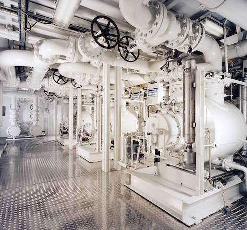

Environmental care is important when choosing multiphase pumping station
(MPPS), because if you use **Rosscor** systems, there is no need for gas
flaring and also the risk of leakage reduces significantly.

The certain advantage of using MPPS is reduced number of required
buildings and reduced cost of construction, as there is no need in
separators, gas compressors, vessels and other equipment.

Usage of **Rosscor** multiphase pumping stations allows to pump entire
mixture of oil, water, gas and solid particles from the well cluster to
a central collection point through a single pipeline, which in its turn
significantly reduces the capital costs by reducing the amount of
required equipment at the wellhead.
