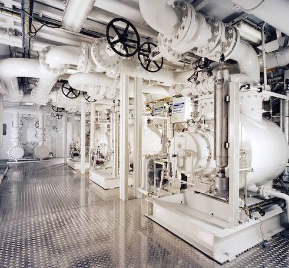

{.width-33 .alignright}

Необходимость заботы об окружающей среде, является важным фактором при
выборе МФНС, т.к. при использовании систем **Rosscor** отсутствует
необходимость в факелах по сжиганию попутного газа, а также значительно
снижается риск утечек.

Определенным плюсом применения МФНС является сокращение количества
необходимых сооружений и уменьшения стоимости строительства за счёт
отсутствия потребности в сепараторах, газовых компрессорах, резервуарных
емкостях и другого оборудования.

Применение мультифазных насосных станций **Rosscor** позволяет
перекачивать всю смесь из нефти, воды, газа и твёрдых частиц из куста
скважин на центральный пункт сбора через единственный трубопровод, что в
свою очередь существенно снижает капитальные расходы благодаря
уменьшению потребности в оборудовании в устье скважины.
