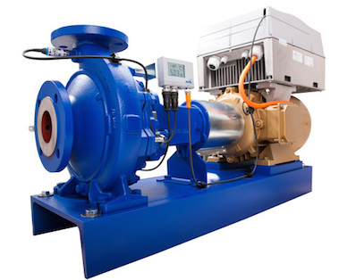

JSC PKF "PromHim-Sfera" supplies a wide range of pumping equipment:
sealed pumps, submersible pumps, pumps for water supply, pumps for
liquids with foreign particles, for oil products, multiphase pump
stations, pumps for the chemical industry, pumps for maintaining
formation pressure in a well, oil main line pumps, pumps for electric
power industry.

Among the manufacturers of pumping equipment supplied by our company
there are such companies as: KSB, STERLING SIHI, KAMAT, WILO, FLOWSERVE,
SAER, AO "MOLDOVAHIDROMASH", etc.

Besides, we supply spare parts for the pumping equipment we offer.

The offered pumps meet a ready sale due to a high degree of their
quality, operation reliability, performance proofed by years and
reasonable prices. If you have any special requirements concerning the
pumping equipment, please provide us with full pump specification, such
as: pumped media, its temperature, flow rate, pump head, installation
site, installation specific features, engine design options.
