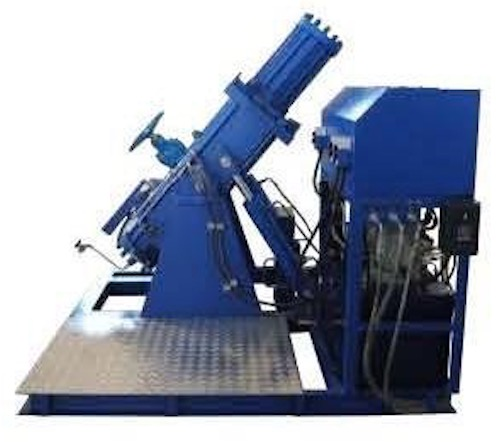

{.width-33 .alignright}

JSC PKF "PromHim-Sfera" supplies facilities for valves testing,
including testing shutoff valves and safety valves. We also supply
various pipeline degreasing and washing facilities.

Shutoff valve testing is performed to measure its technical
characteristics, which in their turn determine the quality degree.
During the testing, such characteristics as leak tightness, durability
and other parameters are evaluated. For the hydraulic testing of valves
special facilities are used, which allow to determine the durability of
construction and the degree of its resistance to the internal pressure
of the operating medium.

**Technical features of the valves testing facilities**

Pipeline valves testing facilities perform testing in different modes:
automatic, manual step-by-step, adjustment control mode and also in the
mode of testing process registration in the pressure-time coordinates.

JSC PKF "PromHim-Sfera" selects and supplies testing facilities for
special demands, prescribed by our customers in questionnaires. We
select testing facility units according to the principles of safety and
performance efficiency.
