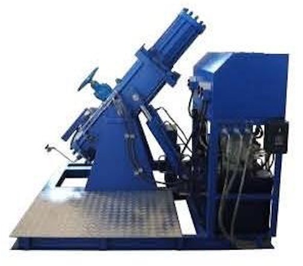

Компания ЗАО ПКФ "ПромХим-Сфера" поставляет стенды для испытания
арматуры, в том числе испытания запорной арматуры, испытания
предохранительных клапанов, а также различные стенды для обезжиривания и
промывки трубопроводов.

Испытание запорной арматуры выполняется для оценки ее свойств, которые,
в свою очередь, определяют уровень качества. При тестировании
производится оценка таких показателей как герметичность, прочность,
параметры. Для гидравлических испытаний арматуры используют специальные
стенды, которые позволяют выявить прочность конструкции и степень ее
сопротивления внутреннему давлению рабочей среды.

## Технические особенности стендов для испытания арматуры

Стенды для испытания трубопроводной арматуры проводят тестирование в
различных режимах: автоматическом, пошаговом ручном, режиме наладочного
управления, а также режиме регистрации испытательного процесса в
координатах "давление-время".

ЗАО ПКФ "ПромХим-Сфера" осуществляет поставку и подбор испытательных
стендов ориентированных на специальные требования, изложенные нашими
клиентами в технических заданиях, подбираем установки на основе
принципов безопасности и эффективности работы.
