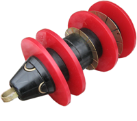

## Pigs and pistons

* Bypass pig
* Rescue pig
* Paraffin removal pig
* Magnetic cleaning pig
* Brush pig
* Dual module pig
* Needle pig for solid deposits removal
* Pig for hard deposits removal
* Pigs with double/multistage diameter

* Magnetic pigs monitoring equipment
* Acoustic monitoring equipment
* Spare parts
* Standard pigs
* Polyurethane foam pigs
* High seal pigs
* Pig passage indicators
* Ball bearing piston
* Pipeline sealers
* Weld seams testers
* Long wear-resistant pig

## Magnetic pigs monitoring equipment

Ground magnetic pigs monitoring equipment is a very reliable system
created especially for field works. The current model is the result of
constant development of equipment, which was created in 1979. This
equipment operates on the principle of identification of the magnetic
field change when a pig passes the sensor. Most types of pigs, including
ball and echo/foam pigs, can be found, if equipped with small magnets.
Magnetic pigs tracking equipment is a special portable system powered by
12 V DC, which can be obtained from a truck or a small battery.

## Acoustic monitoring equipment

This pig tracking system allows an operator to hear the pig as it passes
a pipeline. This system is powered by the sensor which receives
low-energy pulses from the pipeline walls and amplifies the signal
through the control unit to pass a sound to the headphones. The pulses
occur when the pig cups or discs collide with the internal weld seams
between pipes and fittings. Acoustic monitoring equipment is fully
portable and is an ideal addition to the ground magnetic tracking
equipment.
