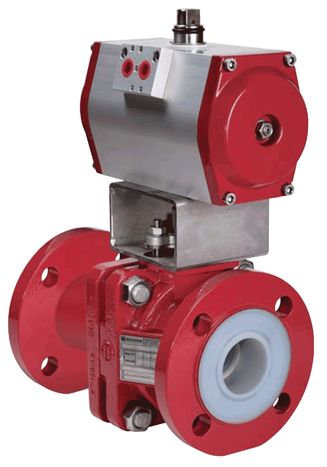

High pressure valves supplied by JSC PKF "PromHim-Sfera" thanks to
special technical solutions and set of proposed options optimized for
the climate conditions of the Far North are the most popular within oil
and gas and energy industry of the Russian Federation.

## Shutoff valves

Shutoff valve is one of the most common types of pipeline valves. This
is a device, in which the shut-off or regulating element reciprocates
parallel to the axis of the operating medium flow.

## Return rotary valves

Return rotary valves are designed for automatic prevention of the return
flow of the operating medium in pipelines. Return rotary valves are
subdivided into lifting and rotary. Lifting return valves have a
reciprocating disc. The return rotary valve is equipped with a trim,
which rotates around a horizontal axis, which is located higher than a
valve seat center.

## Cutoff valves

Cutoff valves are the types of shutoff valves, the basic parameter of
which is their quick response. They are used in a system when it is
necessary to apply the valves which ensure the minimum possible opening
or closing time. For this purpose electric, pneumatic or electromagnetic
drives are installed on the valves.

## Safety valves

Safety valve is a pipe fitting designed for protection from mechanical
breakdown of vessels and pipelines with excessive pressure by automatic
discharge of excess liquid, vaporized and gaseous medium from the
systems and vessels with excessive pressure at extreme pressure boost.

## Distribution valves

Distribution valves are designed for directing the operating medium to
one of the two (or more) served pipelines. Distribution valves are most
frequently used to control pneumatic and hydraulic drives. They are also
used for air sampling from several chambers.

## Mixing valves

Mixing valves are used for mixing different mediums such as cold and hot
water in appropriate proportions, maintaining some specific parameter at
constant degree (e.g. mixture temperature) or changing it according to
some required regulation.

## Electromagnetic valves

Electromagnetic valves can be subdivided into two basic types: valves of
direct and indirect action. Electromagnetic valves of direct action
ensure opening and closing of valves by the core movement at
electromagnetic valve coil feeding. In case of indirect action
construction the coil feeding opens the pilot valve and the main valve
opening occurs under the influence of the medium pressure or its
compensation at minimum mechanical effort.
