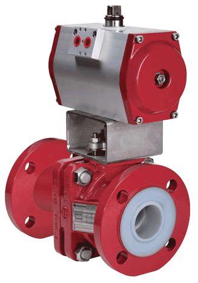

Клапаны высокого давления поставляемые ЗАО ПКФ "ПромХим-Сфера"
благодаря специальным техническим решениям и набором предлагаемых опций,
оптимизированным для климатических условий крайнего севера, наиболее
популярны в нефтегазовом и энергетическом комплексах Российской
Федерации.

## Клапаны запорные

Запорный клапан -- один из распространенных видов трубопроводной
арматуры. Это устройство, в котором запорный или регулирующий орган
перемещается возвратно-поступательно параллельно оси потока рабочей
среды. Одно из распространенных названий запорного клапана -- вентиль,
но на самом деле по ГОСТ 24856-81 применение синонима "вентиль" -- не
рекомендуется.

## Клапаны обратные поворотные

Клапаны обратные поворотные предназначены для автоматического
предотвращения обратного потока рабочей среды в трубопроводах. Клапан
обратный поворотный подразделяется на подъёмный и поворотный. Подъёмные
обратные клапаны имеют диск, совершающий обратно-поступательные
движения. Клапан обратный поворотный снабжен затвором, который
поворачивается вокруг горизонтальной оси, расположенной выше центра
седла клапана.

## Клапаны отсечные

Клапаны отсечные -- вид клапанов запорных, основной характеристикой
которых является быстродействие при срабатывании. Их используют, когда в
системе необходимо применить арматуру, обеспечивающую минимально
возможное время при открытии или закрытии. Для этих целей на клапана
устанавливают электро-, пневматические или электромагнитные привода.

## Клапаны предохранительные

Предохранительный клапан -- трубопроводная арматура, предназначенная
для защиты от механического разрушения сосудов и трубопроводов с
избыточным давлением, путем автоматического выпуска избытка жидкой,
паро- и газообразной среды из систем и сосудов с избыточным давлением
при чрезмерном повышении давления.

## Клапаны распределительные

Распределительные клапаны предназначены для направления рабочей среды в
один из двух (или больше) обслуживаемых трубопроводов. Наиболее часто
распределительный клапан используется для управления пневмоприводами и
гидроприводами. Он используется также для отбора проб воздуха из
нескольких камер.

## Клапаны смесительные

Смесительные клапаны используется для смешивания в соответствующих
пропорциях различных сред, например холодную и горячую воду, выдерживая
постоянным определенный параметр (например, температуру смеси) или
изменяя его по требуемому закону.

## Клапаны электромагнитные

Электромагнитные клапаны можно разделить на два основных типа: прямого и
не прямого действия. Электромагнитные клапаны прямого действия
обеспечивают открытие или закрытие клапанов за счет движения сердечника
при запитывании катушки электромагнитного клапана. В конструкции
непрямого действия запитывания катушки открывает пилотный клапан, а
открытие основного клапана уже происходит при воздействии давления среды
или его компенсации при минимальных механических усилий.
