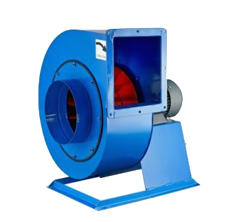

**Вентиляция помещения** -- это постоянная замена отработанного в
процессе жизнедеятельности человека воздуха. Вентиляция происходит за
счёт удаления воздуха через систему вытяжных магистралей и забором
свежего воздуха с улицы через туже систему, но через впускные каналы
магистрали. Иногда воздух с улицы дополнительно обрабатывается
специальными очистными фильтрами для улучшения его качества.

Вентиляция помещений, не важно, производственных или промышленных, это
прежде всего способ поддержания постоянной температуры и влажности
внутри самого помещения. Ведь в процессе нахождения человека в
помещении, выделяется тепло от его тела, а также изменяется влажноть
воздуха. Именно для этого необходима качественная вентиляция помещения.
Чтобы установить систему вентиляции помещения, необходимо сначала её
спроектировать. Ведь без точных расчётов, в которые входит учёт всех
показателей, вентиляция помещения будет неэффективна.

Показатели влияющие на проект вентиляции помещения:
* количество находящихся людей в помещении,
* площадь помещения,
* объем помещения,
* высота потолков,
* время нахождения людей в помещении,
* уровень загруженности помещения,
* категория работ в помещении,
* дополнительные коэффициенты.

**Вентиляция промышленных помещений** может не отличатся от **вентиляции
производственных помещений** по схемам проектирования. Так как
промышленное и производственное помещения могут быть одинаковыми по
своим размерам. Даже если они будут отличаться по размерам, схема
прокладки системы может не измениться. Изменятся лишь показатели,
влияющие на расчёт мощности самой вентиляции и её агрегатов
(вентиляторов, клапанов, размеры сечения магистрали).

Компания ЗАО ПКФ "ПромХим-Сфера" занимается поставками любого
оборудования, которое необходимо для качественного кондиционирования и
вентиляции воздуха на предприятиях промышленного и производственного
назначения. Также мы обеспечим вас промышленным и производственным
оборудованием для систем дымоудаления.

Наша компания занимается вентиляцией для промышленных и производственных
зданий. Если вы хотите установить качественную вентиляцию в промышленном
или производственном помещении, обращайтесь к нам в ЗАО ПКФ
"ПромХим-Сфера".
